# M284 human review

Automated qualification passed at GSP `d2d25a2` and VisPy2 `66734a3`. This page is the project
owner's review index; checking these boxes is the remaining S065 acceptance step. Matplotlib and
Datoviz preserve the same semantic scene but are not expected to match pixels.

## Static captures

| Journey | Matplotlib | Datoviz |
|---|---|---|
| Priority 2D | [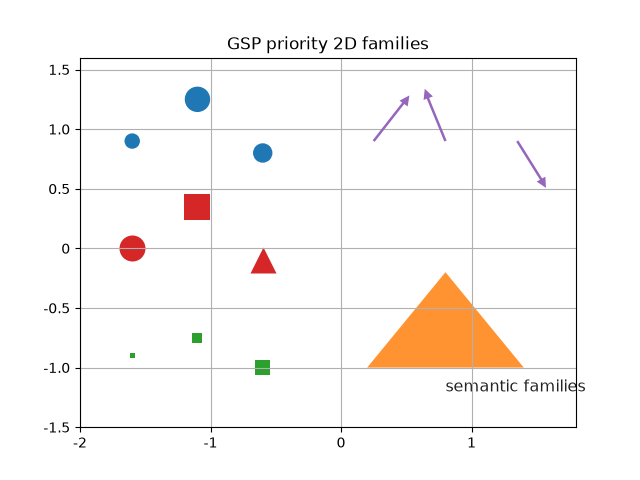](../examples/artifacts/matplotlib-gallery-01-priority-2d.png) | [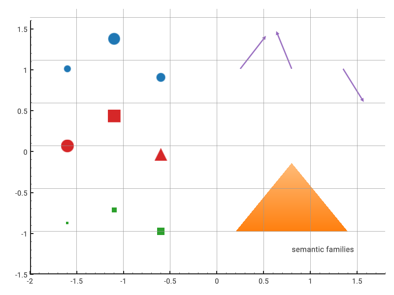](../examples/artifacts/datoviz-gallery-01-priority-2d.png) |
| Perspective 3D | [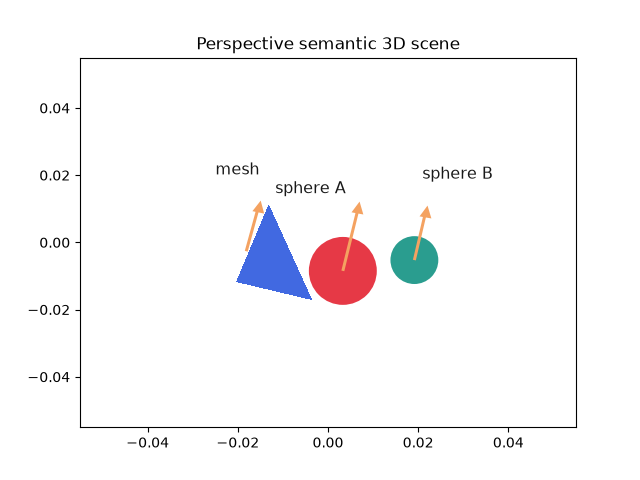](../examples/artifacts/matplotlib-gallery-02-perspective-3d.png) | [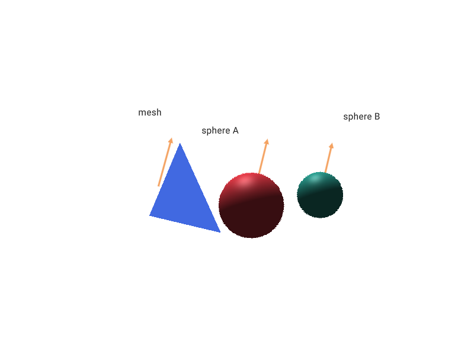](../examples/artifacts/datoviz-gallery-02-perspective-3d.png) |
| Orthographic 3D | [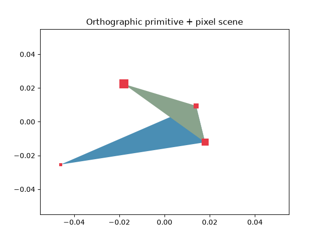](../examples/artifacts/matplotlib-gallery-03-orthographic-3d.png) | [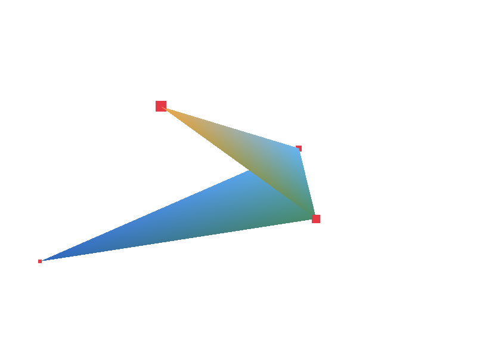](../examples/artifacts/datoviz-gallery-03-orthographic-3d.png) |
| Camera fit | [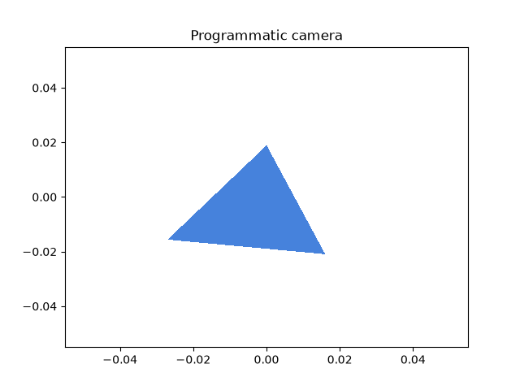](../examples/artifacts/matplotlib-gallery-04-00-fit.png) | [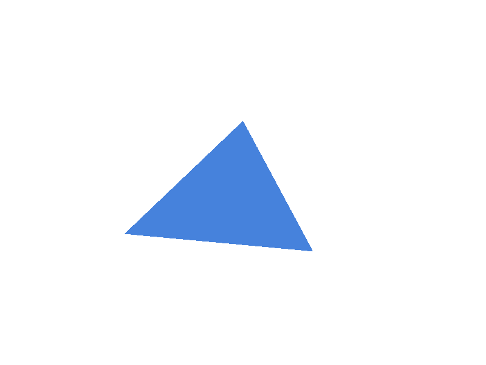](../examples/artifacts/datoviz-gallery-04-00-fit.png) |
| Camera orbit | [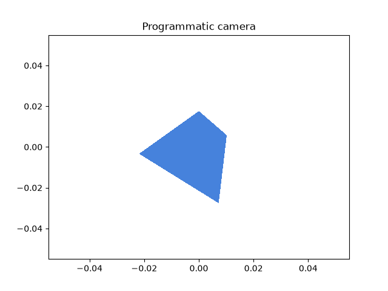](../examples/artifacts/matplotlib-gallery-04-01-orbit.png) | [](../examples/artifacts/datoviz-gallery-04-01-orbit.png) |
| Camera pan | [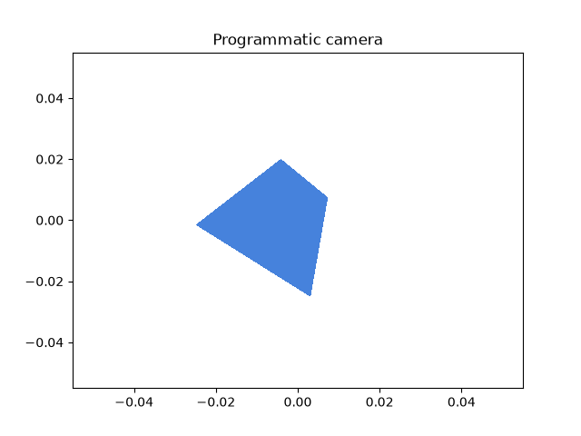](../examples/artifacts/matplotlib-gallery-04-02-pan.png) | [](../examples/artifacts/datoviz-gallery-04-02-pan.png) |
| Camera zoom | [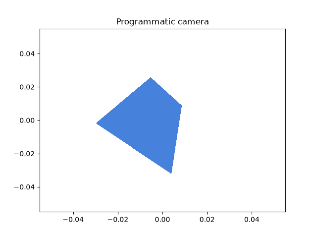](../examples/artifacts/matplotlib-gallery-04-03-zoom.png) | [](../examples/artifacts/datoviz-gallery-04-03-zoom.png) |

## Static acceptance

- [ ] 2D composition is legible and complete on both backends.
- [ ] 3D perspective and orthographic composition is legible and complete on both backends.
- [ ] Fit, orbit, pan, and zoom states are distinct, coherent, and unclipped.
- [ ] Pixel visuals have the intended positions and relative logical sizes.
- [ ] Sphere visuals are distinct and correctly placed.
- [ ] Vector visuals preserve direction and relative magnitude.
- [ ] Generic primitive visuals preserve topology and placement.
- [ ] Text is legible, separated, and correctly associated with the scene.
- [ ] Mesh geometry and depth are credible on both backends.

Known adaptations: Matplotlib uses a 640×480 publication canvas and adapted painter/projection
paths; Datoviz uses an 800×600 native GPU capture. Fonts, metrics, guides, antialiasing, primitive
interpolation, vector heads, sphere shading/depth, and billboard placement may differ. Matplotlib
spheres are adapted circles, Matplotlib 3D vectors/pixels/text are adapted overlays, and neither
backend claims strict cross-backend pixel parity or billboard occlusion parity.

## Live Datoviz review

Run this exact qualified-wheel command from the VisPy2 checkout:

```console
PYTHONPATH=/Users/cyrille/GIT/Viz/gsp/.venv/lib/python3.13/site-packages:/Users/cyrille/GIT/Viz/datoviz \
GSP_DATOVIZ_SOURCE=/Users/cyrille/GIT/Viz/datoviz \
GSP_DATOVIZ_ENABLE_EXPERIMENTAL_VIEW3D_NAV=1 \
/private/tmp/m284-qualification.79VRUA/wheel-env/bin/python \
examples/gallery_05_datoviz_navigation.py
```

Controls: left-drag orbits, right-drag pans, the wheel zooms, and double-click resets the camera.
Close the native window to end the blocking loop and release the context-managed session. If the
window cannot be closed, focus the terminal and use `Ctrl-C`; verify that the process exits.

- [ ] Live orbit, pan, zoom, and reset controls respond naturally.
- [ ] Closing the window cleans up the process and native resources.

## Query and capability review

The installed-wheel checks produced a point `HIT` with caller identity preserved and a structured
`UNSUPPORTED` result for the deliberately unsupported sphere/3D request. Review the exact-head
[capability matrix](capability-matrix.md) for the bounded contracts and adaptations.

- [ ] Point `HIT` behavior is sufficient for the first experimental release.
- [ ] Structured `UNSUPPORTED` behavior is clear and honest for unsupported queries.

Owner decision:

- [ ] Accept S065 experimental feature coverage.
- [ ] Request bounded corrections before accepting S065.
