# M292 requalified owner review

M292 requalified this portable review pack after the owner's M284 findings and the Datoviz binding
safety repairs. All fourteen captures were regenerated from exact committed wheels outside both
source trees and are 800×600. Camera raster geometry now differs by at most 1.2% in either
dimension. Both backends preserve the same semantic scene and canvas, but are not expected to match
pixels.

## Static captures

The captures use direct repository-relative image references. Each preview also has a plain
full-size link for Markdown viewers that do not display inline images.

### Priority 2D

Matplotlib ([open full size](../examples/artifacts/matplotlib-gallery-01-priority-2d.png))

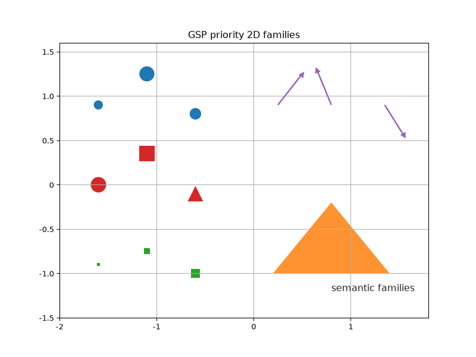

Datoviz ([open full size](../examples/artifacts/datoviz-gallery-01-priority-2d.png))

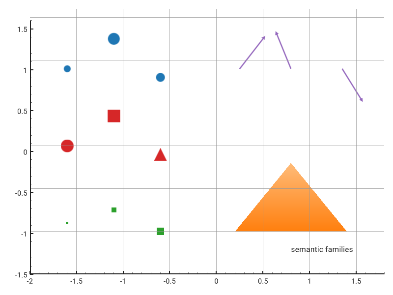

### Perspective 3D

Matplotlib ([open full size](../examples/artifacts/matplotlib-gallery-02-perspective-3d.png))

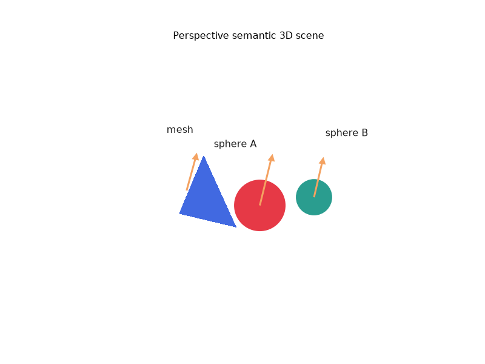

Datoviz ([open full size](../examples/artifacts/datoviz-gallery-02-perspective-3d.png))

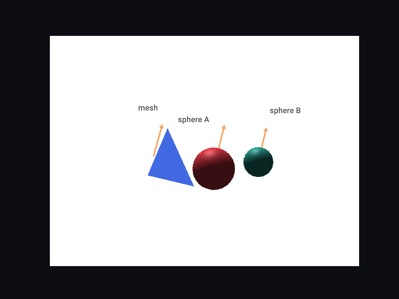

### Orthographic 3D

Matplotlib ([open full size](../examples/artifacts/matplotlib-gallery-03-orthographic-3d.png))

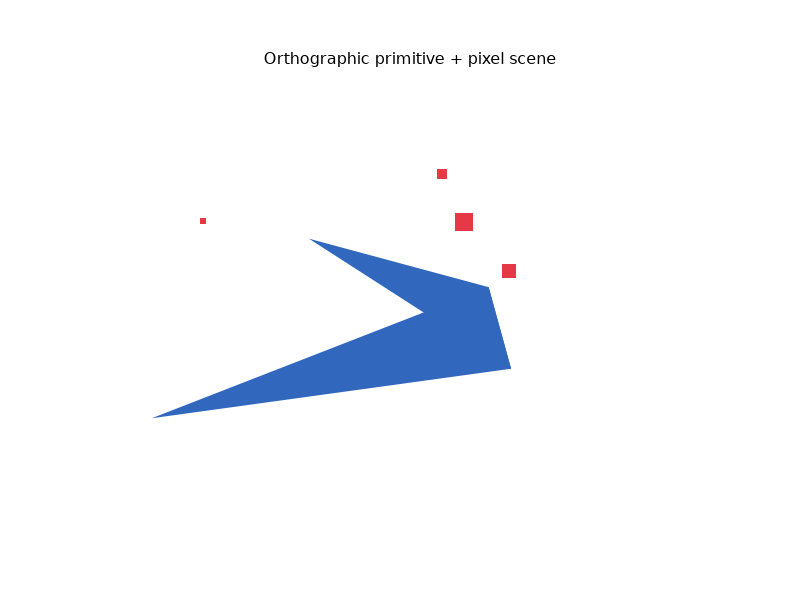

Datoviz ([open full size](../examples/artifacts/datoviz-gallery-03-orthographic-3d.png))

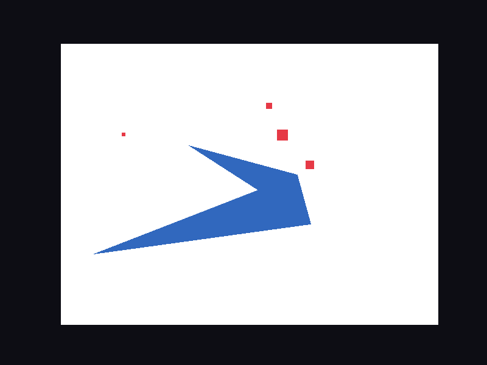

### Camera fit

Matplotlib ([open full size](../examples/artifacts/matplotlib-gallery-04-00-fit.png))

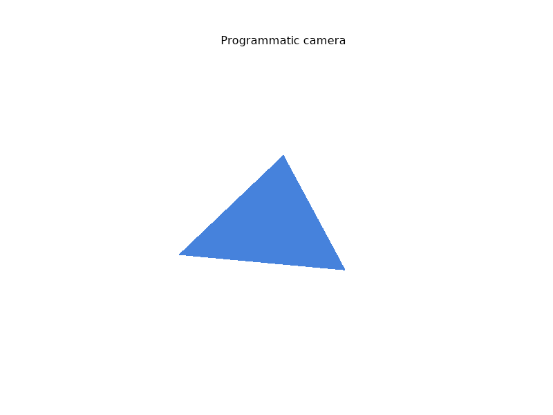

Datoviz ([open full size](../examples/artifacts/datoviz-gallery-04-00-fit.png))

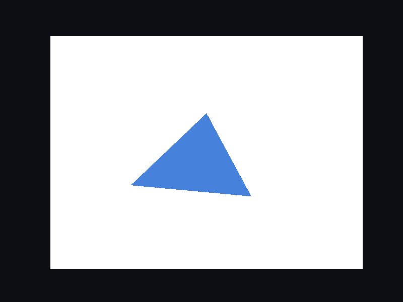

### Camera orbit

Matplotlib ([open full size](../examples/artifacts/matplotlib-gallery-04-01-orbit.png))

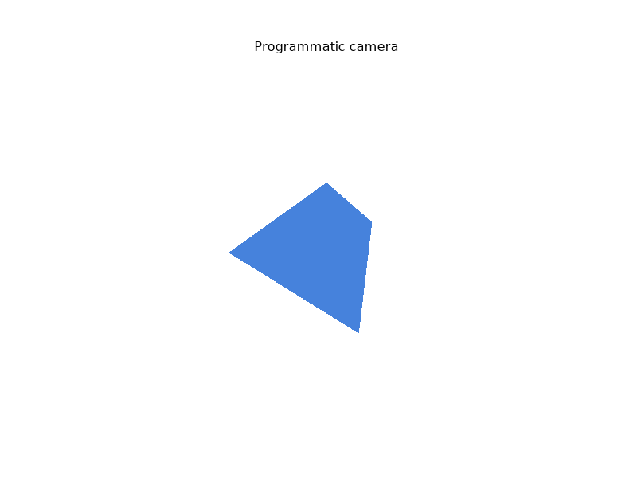

Datoviz ([open full size](../examples/artifacts/datoviz-gallery-04-01-orbit.png))


### Camera pan

Matplotlib ([open full size](../examples/artifacts/matplotlib-gallery-04-02-pan.png))

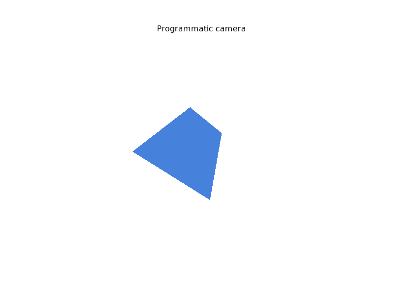

Datoviz ([open full size](../examples/artifacts/datoviz-gallery-04-02-pan.png))


### Camera zoom

Matplotlib ([open full size](../examples/artifacts/matplotlib-gallery-04-03-zoom.png))

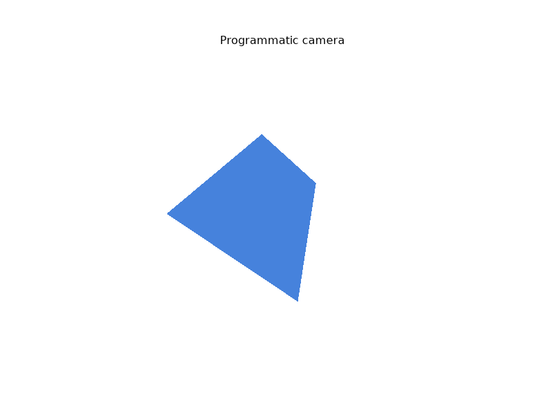

Datoviz ([open full size](../examples/artifacts/datoviz-gallery-04-03-zoom.png))


## Static acceptance

- [ ] 2D composition is legible and complete on both backends.
- [ ] 3D perspective and orthographic composition is legible and complete on both backends.
- [ ] Fit, orbit, pan, and zoom states are distinct, coherent, and unclipped.
- [ ] Pixel visuals have the intended positions and relative logical sizes.
- [ ] Sphere visuals are distinct and correctly placed.
- [ ] Vector visuals preserve direction and relative magnitude.
- [ ] Gallery 3's uniform primitive preserves topology without implying interpolation parity.
- [ ] Gallery 3's pixel anchors are visibly distinct from primitive vertices.
- [ ] Text is legible, separated, and correctly associated with the scene.
- [ ] Mesh geometry and depth are credible on both backends.

Known adaptations: both backends receive a pixel-exact 800×600 canvas. Matplotlib uses adapted
painter/projection paths and suppresses its unintended native View3D frame. Matplotlib preserves
semantic panel titles. The qualified Datoviz binding has no public `PanelTextGuide` renderer, so
its missing title is explicitly diagnosed as unsupported. Fonts, metrics, antialiasing, vector
heads, and billboard placement may differ. Datoviz raycast spheres use native shading and analytic
surface depth, while Matplotlib spheres are flat projected circles with adapted depth ordering;
this is not a sphere material contract. Matplotlib 3D vectors/pixels/text are adapted overlays,
and neither backend claims strict pixel parity or billboard occlusion parity.

## Live Datoviz review

The exact-wheel run is already recorded in the automated qualification evidence. For the portable
owner interaction check, copy this repository-relative command from the Mission Control
`GSP_API` checkout. It changes into the sibling VisPy2 checkout itself:

```console
cd ../vispy2 &&
GSP_DATOVIZ_SOURCE=../datoviz \
GSP_DATOVIZ_ENABLE_EXPERIMENTAL_VIEW3D_NAV=1 \
PYTHONPATH=src:../datoviz \
../gsp/.venv/bin/python examples/gallery_05_datoviz_navigation.py
```

Controls: left-drag orbits, right-drag pans, the wheel zooms, and double-click resets the camera.
Close the native window to end the blocking loop and release the context-managed session. If the
window cannot be closed, focus the terminal and use `Ctrl-C`; verify that the process exits.

- [ ] Live orbit, pan, zoom, and reset controls respond naturally.
- [ ] Closing the window cleans up the process and native resources.

## Query and capability review

The installed-wheel checks produced a point `HIT` with caller identity preserved and a structured
`UNSUPPORTED` result for the deliberately unsupported sphere/3D request. Review the exact-head
[capability matrix](capability-matrix.md) for the bounded contracts and adaptations.

- [ ] Point `HIT` behavior is sufficient for the first experimental release.
- [ ] Structured `UNSUPPORTED` behavior is clear and honest for unsupported queries.

Owner decision:

- [ ] Accept S065 experimental feature coverage.
- [ ] Request bounded corrections before accepting S065.
